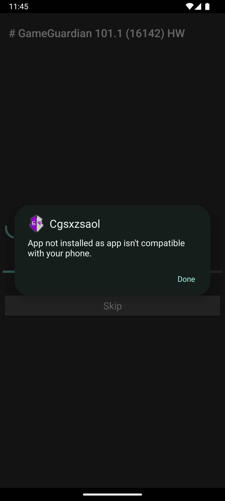
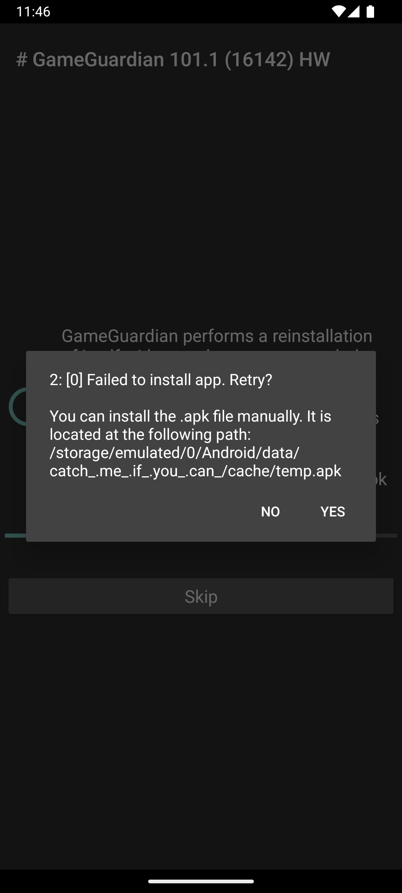
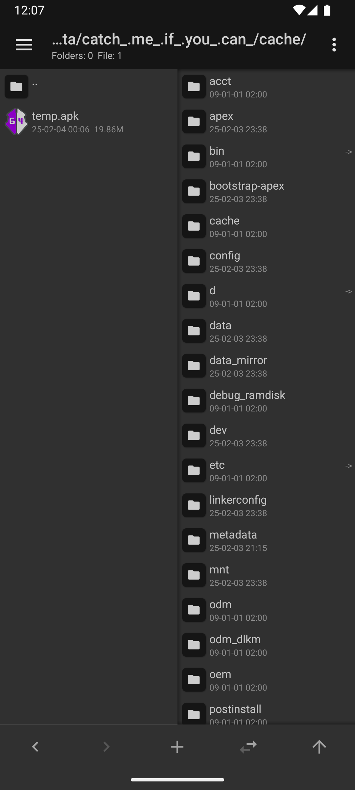
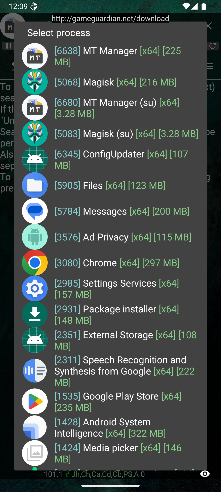
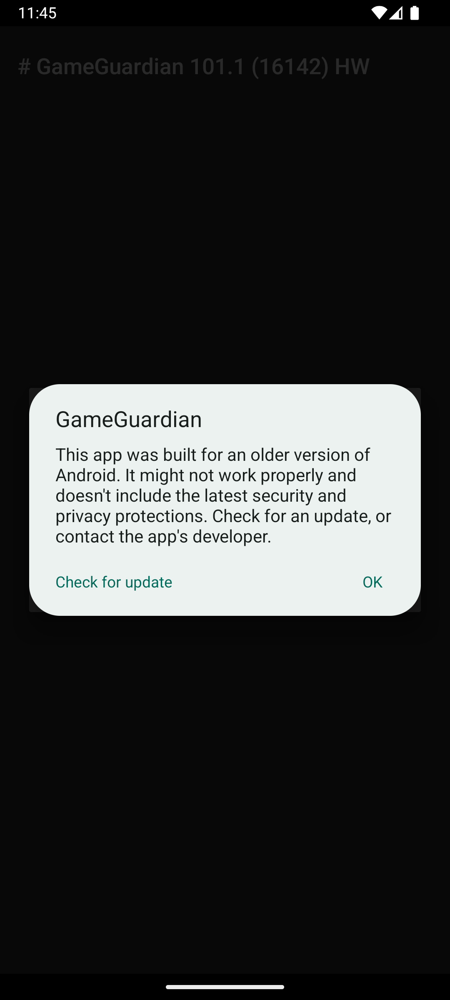

# Welcome to Android 13-14-15 Game Guardian Installation Guide!
<li>Android Game Guardian Installation Guide. Root(Tested on Android 15). Virtual Machine(Tested on Android 14).</li>

# 1.0 Difference Between Root and VM
<li>Root</li>
Simply it gives you permissions at system level. For more detai click <a href="https://en.wikipedia.org/wiki/Rooting_(Android)">here.</a>

<li>Virtual Machine</li>
Simply it creates a new Android in your device. Without touching your own Android and files dont worry about that, its more like 2 operating system in one. For more detail click <a href="https://en.wikipedia.org/wiki/Virtual_machine">here.</a>

# 1.1 Root
<li>How To Root Your Phone?</li>
My personal suggestion is using <a href="https://github.com/topjohnwu/Magisk">Magisk.</a> Its probably the safest way to root your phone. Magisk already introducing steps in their reposity, in summary; you must have a PC. Otherwise you wont be able to use <a href="https://developer.android.com/tools/adb?hl=en">adb.</a> You have to unlock your bootloader too, about unlocking bootloader, I cant suggest someting because its very based on your phone brand and their policy. Phone brands like Xiaomi and Samsung are allowing to unlock bootloader easy, but in other brands this may cant be that easy, ex: OPPO. After unlocking your bootloader you have to find your OS image. Then patch it with Magisk. About how to find OS image, you can search your OS version ex: Xiaomi MIUI Global 14.0.7. If you cant find your OS image on the net you can also use <a href="https://twrp.me/">TWRP</a> to extract it. For rest you can follow Magisk's own documentation I am not taking any responsibility its all your responsibility to root your phone, if your device becomes unusable you cant blame us.

> [!CAUTION]
> Dont forget its just a summary you MUST check Magisk's own documentation.

# 1.2 Virtual Machine
> [!NOTE]
> I didnt try all of them by myself, so I can may give wrong property let me know if I gave it some property wrong.
<li>Which Virtual Machine Should I Use?</li>
Well to be honest, I dont really know how good are VMs. Still I can prefer some VMs:
<h3>Virtual Master - Android Clone</h3>
You can follow this <a href="https://play.google.com/store/apps/details?id=com.clone.android.dual.space&hl=en">link</a> to install. At this point you must have VIP to install GG, you will need a rooted custom rom.

<li>Android Support: A5.1.1, A7.1.2, A9.0.0, A11.0.0, + Good point, it has custom rom support but its a VIP feature.</li>
<li>Support Google Play.</li>

<h3>VPhoneOS - *Recommended</h3>
You can follow this <a href="https://play.google.com/store/apps/details?id=com.yoyo.snake.rush&hl=en">link</a> to install. Simple and ready-to-use. And comes with Root support.
<li>Android Support: A7, A10, A12 + Custom GAME Rom.</li>
<li>Default Root support.</li>
<li>Support Google Play.</li>

<h3>VMOS Pro</h3>
I havent used this app like 2 years and now its very different, still you can prefer and give it a try. You can follow this <a href="https://play.google.com/store/apps/details?id=com.vmos.google&hl=en">link</a> to install.
<li>Android Support: A5.1, A7.1, A9.0</li>
<li>Root Support</li>
<li>Xposed Support</li>
<li>Google Play Support</li>
<h3>X8SB and F1 VM - Last Option</h3>
I dont have much knowledge about them you can watch YouTube videos.

> [!WARNING]
> Im not sure about their dependability! Im also not portraying them as unreliable! Its your choice.

<a href="http://x8sb.com/">X8BS</a>

<a href="https://f1vm.com/">F1 VM</a>

# 1.3 Virtual Space
They are not heavy as VMs, they are working like app cloners. To run GG with in virtual space it have to support GG. On high Androids like A11+ they are not supporting anymore. Still if you want you can visit Game Guardians own Virtual Space section go <a href="https://gameguardian.net/forum/topic/19421-virtual-spaces-to-run-gameguardian-without-root/">here.</a>

# 1.4 Installing Game Guardian
Go and download Game Guardian from this <a href="https://gameguardian.net/download">link.</a>
<h2>Android 15 Compatible Issue</h2>
<li>Install default Game Guardian APK with <a href="https://mt-manager.en.uptodown.com/android/download">MT Manager</a>. If you dont install with MT Manager you can get error. At least this method worked. Error image:</li>

  

<li>After you choosing the arch. Game Guardian will install real app, at this point you can get a error like that:</li>

  
  

<li>As the app said, you can install the apk manually. Go MT Manager and find the specified location and install the app.</li>

  

<li>And done!</li>

  

<li>If you face a error like that, just ignore it.</li>

  

# 1.5 Bad Results
If all of these methods dont work you can browse this <a href="https://gameguardian.net/forum/topic/38963-game-guardian-android-14/">forum</a> from Game Guarian Forums.

# Thank You For Reading!
